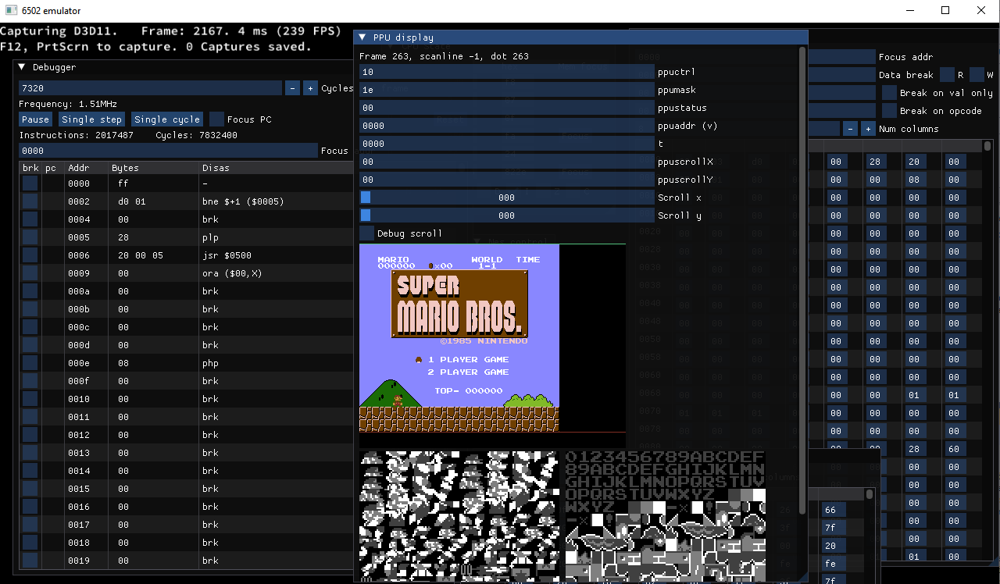
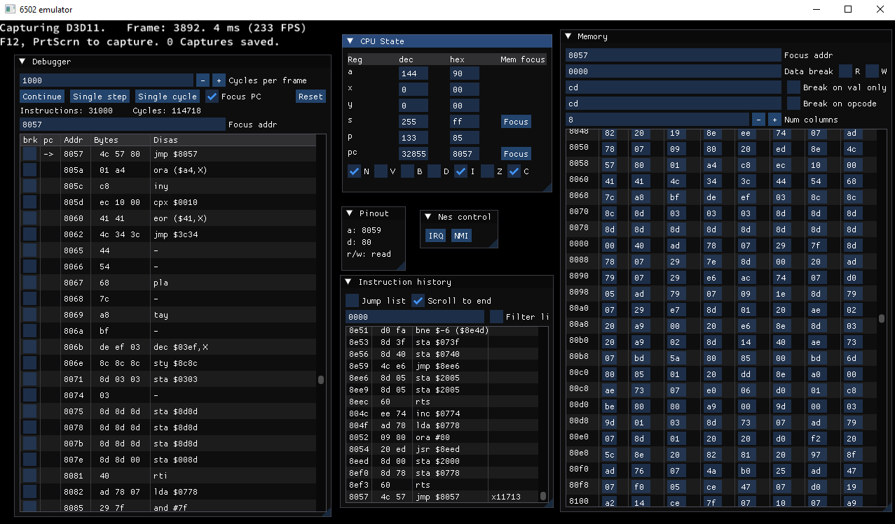

# NES emulator

NES emulator in C++ and ImGui, built in the Locomotive Engine.

Features:
- Graphical debugger
- CHR ROM viewer
- Instruction breakpoints
- Data breakpoints
- Register view and editing
- Memory view and editing

